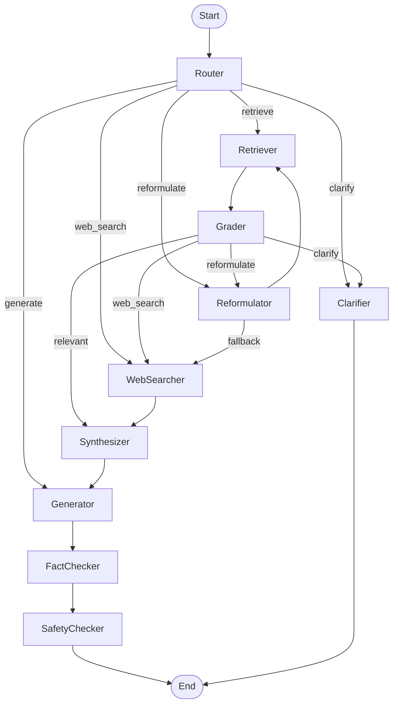

# Advanced Agentic RAG System

A powerful, multi-agent Retrieval-Augmented Generation (RAG) application built with Streamlit, LangChain, and Groq LLMs. This project demonstrates a modular, self-correcting workflow for answering user queries using both internal knowledge sources and real-time web search, with built-in fact-checking and safety mechanisms.

---

## Key Features

- Multi-Agent Workflow: Modular agents for routing, retrieval, query reformulation, web search, synthesis, answer generation, fact-checking, and safety checking.
- Hybrid Knowledge Sources: Supports both uploaded files (PDF, DOCX, TXT) and URLs as knowledge bases, with fallback to default sources.
- Dynamic Query Handling: Automatically routes queries to the best agent (internal retrieval, web search, clarification, etc.) based on context.
- Self-Correction: Reformulates queries and retries retrieval before falling back to web search.
- Fact-Checking: Extracts factual claims from generated answers and verifies them using real-time web search.
- Safety Checking: Analyzes generated content for harmful or inappropriate material and revises or blocks unsafe responses.
- Interactive UI: Streamlit-based chat interface with workflow visualization, logs, and configuration sidebar.
- Configurable Parameters: Easily adjust chunk size, retriever top-K, and LLM temperature from the sidebar.

---

## Architecture and Workflow



Agent Roles:
- Router: Decides the best workflow path for each query.
- Retriever: Fetches relevant documents from the internal knowledge base.
- Reformulator: Improves queries for better retrieval.
- WebSearcher: Finds real-time, external information.
- Synthesizer: Combines information from various sources.
- Generator: Creates the final answer.
- FactChecker: Verifies factual claims in the generated answer.
- SafetyChecker: Ensures generated content is safe and appropriate.
- Clarifier: Asks user for more details if needed.

---

## Installation and Setup

### 1. Clone the Repository

```bash
git clone https://github.com/rudra-patel/advanced-agentic-rag.git
cd advanced-agentic-rag
```

### 2. Create a Virtual Environment

```bash
python -m venv venv
source venv/bin/activate  # On Windows: venv\Scripts\activate
```

### 3. Install Dependencies

```bash
pip install -r requirements.txt
```

Note: This project requires Python 3.9+.

### 4. Set Up API Keys

Create a .streamlit/secrets.toml file in the project root with the following content:

```toml
LANGCHAIN_API_KEY = "your_langchain_api_key"
TAVILY_API_KEY = "your_tavily_api_key"
GOOGLE_API_KEY = "your_google_api_key"
GROQ_API_KEY = "your_groq_api_key"
```

- Get your API keys from:
  - LangChain (https://smith.langchain.com/)
  - Tavily (https://app.tavily.com/)
  - Google Generative AI (https://ai.google.dev/)
  - Groq (https://console.groq.com/)

### 5. Run the Application

```bash
streamlit run app.py
```

---

## Usage

1. Configure Knowledge Sources:
   - Add URLs (one per line) and/or upload files (TXT, PDF, DOCX) in the sidebar.
   - Adjust chunk size, retriever K, and LLM temperature as needed.
   - Click "Apply Parameters and Update Knowledge" to refresh the knowledge base.

2. Chat:
   - Enter your question in the chat input.
   - The system will process your query through the multi-agent workflow and display the answer.
   - View workflow logs, knowledge sources, and a diagram of the agent flow in the "Execution Details" section.

3. Reset:
   - Use "Clear Chat History" to reset the conversation and logs.

---

## Requirements

- Python 3.9+
- Streamlit
- LangChain
- Groq LLMs
- Tavily API
- Google Generative AI API
- ChromaDB
- Other dependencies as listed in requirements.txt

---

## Customization

- Add More Agents: Extend the workflow by adding new agent nodes and decision logic.
- Change LLMs: Swap out LLM providers or models by modifying the agent functions.
- Integrate More Tools: Add new retrieval or search tools as needed.

---

## License

MIT License

---

## Acknowledgements

- LangChain (https://github.com/langchain-ai/langchain)
- Streamlit (https://streamlit.io/)
- Groq (https://groq.com/)
- Tavily (https://tavily.com/)
- Google Generative AI (https://ai.google.dev/)

---

## Maintainer

This project is maintained by Rudra Patel, an AI Automation Engineer with over 2 years of experience in developing intelligent systems. Specializing in Python and deep learning frameworks like TensorFlow and PyTorch, Rudra focuses on implementing advanced RAG architectures and multi-agent workflows.

Contact:
- Email: patel.rudra@ufl.edu
- LinkedIn: https://www.linkedin.com/in/rudra-patel